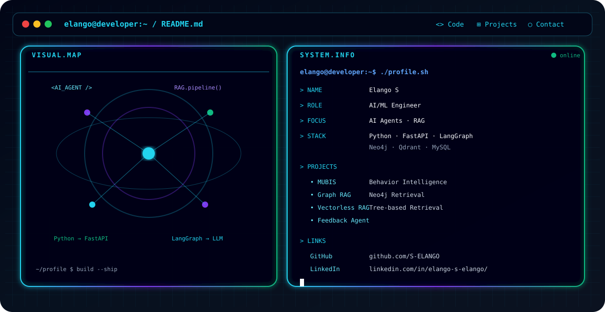

# Hi, I'm Elango S 👋

AI/ML Developer focused on **Python, AI Agents, RAG, and intelligent systems**.

- 🔭 Building AI/ML projects and agentic applications
- 🌱 Learning RAG, LangGraph, A2A, FastAPI, Docker and cloud technologies
- 💡 Interested in turning AI concepts into practical products
- 🔗 [GitHub](https://github.com/S-ELANGO) · [LinkedIn](https://www.linkedin.com/in/elango-s-elango/)

<!-- <svg xmlns="http://w3.org" width="600" height="400" viewBox="0 0 600 400" fill="none">
  
  <!-- Styling for our Markdown Elements 
  

  <!-- Background Card -
  <rect width="600" height="400" class="card-bg" />

  <!-- FOREIGN OBJECT: This lets us render HTML/Markdown layout inside SVG --
  <foreignObject x="20" y="20" width="560" height="360">
    

      
      <!-- Inside here, you write HTML styled exactly like Markdown content -->
      <h1># Elango | AI Engineer</h1>
      
Welcome to my profile card! This layout is built entirely with text styled as Markdown syntax embedded right within an SVG.

      
      <h2>## Core Tech Stack</h2>
      <ul>
        <li><strong>Language:</strong> Python, TypeScript</li>
        <li><strong>Frameworks:</strong> <code>FastAPI</code>, <code>LangGraph</code>, LangChain</li>
        <li><strong>Databases:</strong> Neo4j, Qdrant Vector DB</li>
  </foreignObject>
</svg>
      </ul>

      <h2>## Current Status</h2>
      
Building automated workflow <code>RAG.pipeline()</code> agents.

    

